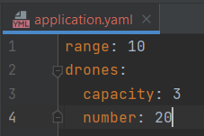

# Su Corrientazo A Domicilio

### This repository contains the proposed solution for the S4N backend challenge.

## How to use the App

* Modify the [application.yaml](src/main/resources/application.yaml) with the desired configuration:

* Where:
    * Restaurant range: This will be the magnitude limit for the drone position. A custom exception is thrown when the
      drone position magnitude is greater than this value.
    * Drones capacity: This is the maximum number of deliveries that each drone can make in a single fly.
    * Number of drones: This is the number of drones in the restaurant.

* Create the input files inside the folder [drones_orders](drones_orders). You can use any file name for the orders since they are
  assigned based on the reading order. The order assignment is done in this way to avoid the dependency in a filename
  structure (which could generate issues).

* Run the program and inspect the output inside the folder [drones_reports](drones_reports).

## Notes

* The orders filenames don't follow any naming structure and are assigned to the drones in the reading order.
* All the drones returned home (0,0,N) after making all the deliveries and generating the reports.
* If there are more orders than drones, each remaining order will be made by the first available drone that arrives at
  the restaurant after finishes its task.
* The report output for the delivery routes that are outside the restaurant range will be:
  ~~~
  The drone' delivery path is out of the restaurant range.
  ~~~
* This project uses Lombok to generate the getters, setters, and constructors, so you will likely
  to [configure your IDE](https://projectlombok.org/setup/overview).
